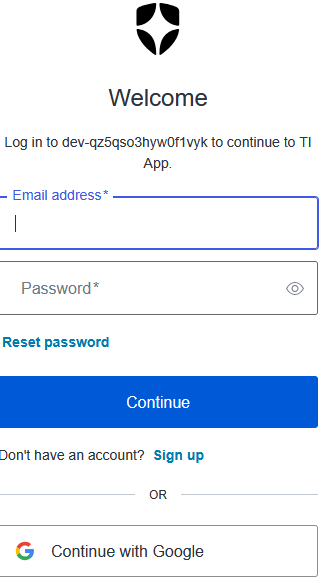

# User Interface

The application is a Single Page Application (SPA) built with **React**, **Vite**, and **Nginx**.

## Login

> Users authenticate using **Okta** with the OAuth 2.0 Authorization Code Flow. 

> Unauthenticated users 
> either if they open http://localhost:8080 then they are automatically redirected to the Okta login page.
> or if they open http://localhost:5000/dashboard-page then default public view is opened and there is Login button.

> After successful authentication, users are redirected to the Dashboard.

---

## Dashboard

The Dashboard is the main application page for managing the knowledge base.

### Import

Allows users to upload **Excel (.xlsx)** or **CSV** files containing questions, answers, resources, and code examples.

Import is processed asynchronously through RabbitMQ.

After completion, the user receives a notification:

> **Import completed successfully. Refresh the page to view the newly imported questions.**

### Questions Table

The Dashboard displays all stored knowledge entries.

| Select | Question | Answer | Resources | Code | Action |
| ------ | -------- | ------ | --------- | ---- |--------|

The **Resources** and **Code** columns are optional.

Actions: Update or Delete row.

Users can select one or multiple rows for export.

### Add Question

Navigates to the Question Editor page where users can create a new knowledge entry consisting of:

* Question
* Answer
* Resources (optional)
* Code Examples (optional)

### Export CSV

Exports the selected questions to a CSV file.

If no rows are selected, all questions are exported.

After completion:

> **Export completed successfully. Check your Downloads folder.**

### Export Excel

Exports the selected questions to an Excel file.

If no rows are selected, all questions are exported.

After completion:

> **Export completed successfully. Check your Downloads folder.**

---

## Question Editor

The Question Editor allows users to create or update knowledge entries.

Each entry may contain:

* Question
* Answer
* Learning Resources (optional)
* Code Examples (optional)

After saving, the updated information becomes immediately available in the Dashboard.

---

## User Experience

Long-running operations such as **Import** and **Export** are executed asynchronously. Users can continue working while processing is performed in the background.

The UI provides clear feedback for completed operations and displays the latest data after refresh.
