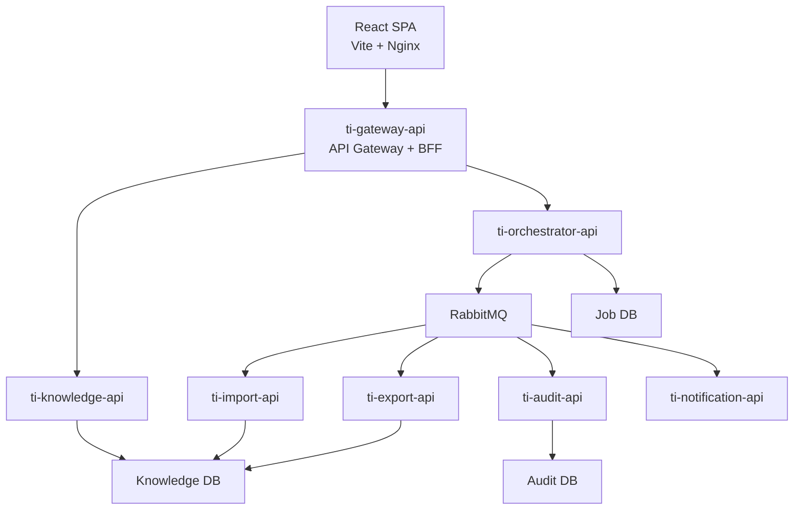

# Architecture

## Overview

The **TI Knowledge Platform** is a cloud-native microservices application 
that demonstrates modern enterprise architecture patterns using Java 21 and Spring Boot 4.

The system follows the principles of:

- Microservices Architecture
- API Gateway Pattern
- Backend For Frontend (BFF) Pattern
- Event-Driven Architecture (EDA)
- Database per Service
- Asynchronous Processing
- Stateless Services

The application consists of independent services that communicate using REST APIs 
and RabbitMQ events.

---

# High-Level Architecture



---

# Architecture Principles

## Single Responsibility

Each microservice owns a single business capability.

| Service                | Responsibility                           |
|------------------------|------------------------------------------|
| ti-knowledge-ui        | User Interface                           |
| ti-gateway-api         | API Gateway, BFF, Authentication         |
| ti-knowledge-api       | Knowledge management                     |
| ti-orchestrator-api    | Long-running job orchestration           |
| ti-import-worker       | Import processing                        |
| ti-export-api          | Export processing                        |
| ti-ai-orchestrator-api | Manage AI Chatbot                        |
| ti-document-worker     | Process (ETL pipeline) uploaded document |
| ti-document-agent      | Document AI Agent                        |
| ti-sql-agent           | Question AI Agent                        |

---

## Database per Service

Every microservice owns its own database.

This prevents tight coupling between services and enables independent deployment and evolution.

```
Knowledge Service
    │
    └── Knowledge Database


ti-document-worker
        |
        └── Embeddings Database
```

---

# Microservices

## ti-ui

Technology

- React
- Vite
- Node.js
- Nginx

Responsibilities

- Login
- Dashboard
- Question Editor
- Import page
- Export actions

The UI never communicates directly with backend services. All requests go through the API Gateway.

---

## ti-gateway-api

Patterns

- API Gateway
- Backend For Frontend (BFF)

Responsibilities

- Request routing
- API aggregation
- Security: OAuth2 Login, Okta Integration, JWT Validation
- Resilience4j

All frontend requests pass through this service.

---

## ti-knowledge-api

The core business service.

Responsibilities

- Manage Questions
- Manage Answers
- Manage Resources
- Manage Code Examples
- Search knowledge base

Provides synchronous REST APIs used by the Dashboard.

---

## ti-orchestrator-api

Coordinates asynchronous business operations.

Responsibilities

- Create Import Job
- Create Export Job
- Track Job Status
- Publish RabbitMQ events

The Dashboard communicates with this service to start long-running operations.

---

## ti-import-api

Processes uploaded Excel and CSV files.

Responsibilities

- Parse files
- Validate data
- Store imported knowledge
- Publish completion events

Import processing is asynchronous.

---

## ti-export-api

Generates downloadable files.

Responsibilities

- Read requested knowledge
- Generate CSV
- Generate Excel
- Publish completion events

---

Future extensions

- Email
- Slack
- Microsoft Teams

---

# Communication

The platform uses two communication styles.

## Synchronous Communication

REST APIs are used for:

- Authentication
- CRUD operations
- Searching questions
- Dashboard requests
- Job status

```
Browser

↓

Gateway

↓

Knowledge Service
```

---

## Asynchronous Communication

RabbitMQ is used for long-running operations.

Examples

- Import Worker
- Document Worker

```
orchestrator Service

↓

RabbitMQ

↓

Import Worker

↓

Knowledge Service

↓

ImportCompletedEvent

↓

UI is notified
```

---

# Event Flow

## Import

```text
User uploads file

        │

        ▼

Gateway

        │

        ▼

orchestrator Service

        │

ImportRequestedEvent

        │

        ▼

RabbitMQ

        │

        ▼

Import Service

        │

Validate and Import

        │

        ▼

Knowledge Database

        │

ImportCompletedEvent

        │

        ▼

UI is notified
```

---

# Why Event-Driven Architecture?

Importing and exporting large datasets may take several seconds or minutes.

Using asynchronous messaging provides several advantages:

- Better user experience
- Improved scalability
- Loose coupling
- Retry capabilities
- Independent service deployment
- Fault tolerance

CRUD operations remain synchronous because they are short-lived and require immediate feedback.

---

# Security Architecture

Authentication

- Okta

Authorization

- OAuth 2.0 Authorization Code Flow

Access Token

- JWT

Gateway

- OAuth2 Client

Backend Services

- OAuth2 Resource Servers

The Gateway validates user authentication before forwarding requests to backend services.

---

# Error Handling

Each service implements:

- Bean Validation
- Global Exception Handler
- Standard HTTP Error Responses
- Structured JSON Errors

Long-running jobs publish failure events instead of blocking user requests.

---

# Design Goals

The architecture demonstrates common enterprise development practices:

- Clear service boundaries
- Independent deployment
- Secure communication
- Asynchronous processing
- Event-driven workflows
- Cloud-ready design
- High maintainability
- Production-ready architecture