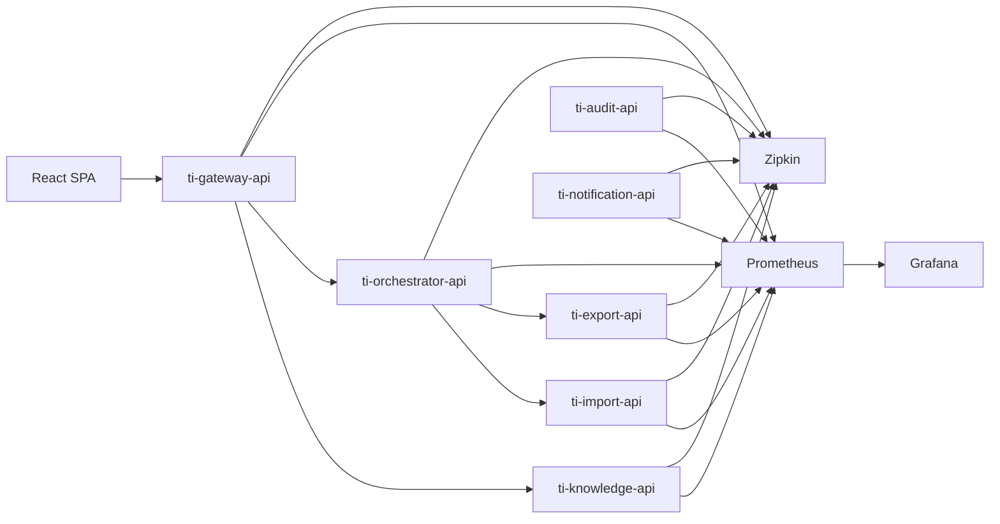

# Observability

## Overview

Observability enables developers to monitor application health, troubleshoot issues, and analyze system behavior.

This project implements a production-like observability stack using open-source technologies that can later be migrated to AWS with minimal configuration changes.

The observability solution includes:

* Spring Boot Actuator
* Micrometer
* Prometheus
* Grafana
* OpenTelemetry
* Zipkin
* Structured JSON Logging

---

# Architecture



---

# Components

## Spring Boot Actuator

Every backend service exposes operational endpoints used for monitoring.

Examples:

* `/actuator/health`
* `/actuator/info`
* `/actuator/prometheus`

---

## Micrometer

Micrometer (micrometer-registry-prometheus) collects application metrics and exposes them in a Prometheus-compatible format.

Examples:

* HTTP request count
* Response time
* JVM memory
* CPU usage
* Thread count
* Database connection pool
* RabbitMQ metrics

---

## Prometheus

Prometheus periodically collects metrics from all backend services.

Responsibilities:

* Metrics collection
* Time-series storage
* Query execution (PromQL)

---

## Grafana

Grafana visualizes application metrics using interactive dashboards.

Example dashboards:

* System Overview
* JVM Metrics
* HTTP Requests
* Database Metrics
* RabbitMQ Metrics
* Business Metrics

---

## OpenTelemetry

OpenTelemetry instruments distributed requests across microservices.

Every incoming request receives a unique trace identifier that is propagated between services.

- tracing-bridge-otel
- exporter-otlp
---

## Zipkin

Zipkin visualizes distributed traces and request execution paths.

Example trace:

```text
Browser

↓

ti-gateway-api

↓

ti-knowledge-api

↓

PostgreSQL
```

For asynchronous workflows:

```text
Browser

↓

ti-gateway-api

↓

ti-orchestrator-api

↓

RabbitMQ

↓

ti-import-api

↓

ti-knowledge-api
```

---

# Metrics

Each backend service exposes standard JVM and application metrics.

Typical metrics include:

## HTTP

* Request count
* Request duration
* Error rate
* Active requests

## JVM

* Heap memory
* Non-heap memory
* Garbage collection
* CPU usage
* Thread count

## Database

* Active connections
* Connection pool usage
* Query execution time

## RabbitMQ

* Published messages
* Consumed messages
* Queue depth
* Consumer count

---

# Business Metrics

Besides infrastructure metrics, the application records business-specific metrics.

Examples:

* Questions created
* Questions updated
* Questions deleted
* Import requests
* Successful imports
* Failed imports
* Export requests
* Successful exports
* Failed exports

These metrics provide insights into application usage and system activity.

---

# Distributed Tracing

Every request receives a unique:

* traceId
* spanId

Distributed tracing enables developers to:

* Follow requests across multiple services
* Measure response times
* Identify bottlenecks
* Troubleshoot failures

Example:

```text
GET /api/questions

traceId: 7f43...

ti-gateway-api

↓

ti-knowledge-api

↓

PostgreSQL
```

---

# Logging

All backend services produce structured JSON logs.

Each log entry includes:

* Timestamp
* Service name
* Log level
* traceId
* spanId
* Request ID
* User ID (when available)
* Message

Example:

```json
{
  "timestamp": "2026-08-01T10:15:30Z",
  "service": "ti-knowledge-api",
  "level": "INFO",
  "traceId": "7f43b6...",
  "spanId": "9ae1c2...",
  "message": "Question created successfully"
}
```

Using the trace identifier, logs can be correlated with Zipkin traces.

---

# Health Checks

Each microservice exposes health endpoints through Spring Boot Actuator.

Typical health indicators include:

* Application status
* Database connectivity
* RabbitMQ connectivity
* Disk space

These endpoints can later be integrated with Kubernetes readiness and liveness probes.

---

# Local Environment

The local development environment includes:

* PostgreSQL
* RabbitMQ
* Prometheus
* Grafana
* Zipkin

All components are started using Docker Compose.

---

# AWS Migration

The observability architecture can be migrated to AWS with minimal changes.

| Local         | AWS                                 |
| ------------- | ----------------------------------- |
| Prometheus    | Amazon Managed Prometheus           |
| Grafana       | Amazon Managed Grafana              |
| Zipkin        | AWS X-Ray                           |
| OpenTelemetry | AWS Distro for OpenTelemetry (ADOT) |
| JSON Logs     | Amazon CloudWatch Logs              |

Because observability is implemented using open standards, no business code changes are required during migration.

---

# Learning Objectives

After completing this module you will have practical experience with:

* Spring Boot Actuator
* Micrometer
* Prometheus
* Grafana
* OpenTelemetry
* Zipkin
* Distributed Tracing
* Structured Logging
* JVM Monitoring
* Application Metrics
* Business Metrics
* Health Checks
* Cloud-ready Observability
