# AWS Deployment Architecture

## Overview

The **TI Knowledge Platform** is designed as a cloud-native application that can be deployed to **Amazon Web Services (AWS)**.

The AWS deployment follows enterprise cloud architecture principles:

- Containerized microservices
- Kubernetes-based orchestration
- Managed AWS services
- Infrastructure as Code
- Secure identity management
- Automated CI/CD deployment
- Production observability

The recommended AWS deployment platform is:

- **Amazon Elastic Kubernetes Service (EKS)** for application workloads
- **Amazon Elastic Container Registry (ECR)** for Docker images
- **Amazon RDS PostgreSQL** for databases
- **Amazon MQ / RabbitMQ on Kubernetes** for messaging
- **AWS Secrets Manager** for sensitive configuration
- **CloudWatch + Prometheus + Grafana** for monitoring

---

# AWS High-Level Architecture

```mermaid
flowchart TB

    User["User"]

    Route53["Route 53"]

    ALB["Application Load Balancer"]

    EKS+Ingres["EKS<br/>Ingres(Nginx)"]

    Knowledge-UI[NGINX<br/>ti-knowledge-ui]

    AI-Question-UI[NGINX<br/>ti-ai-question-ui]

    AI-Chatbot-UI[NGINX<br/>ti-ai-chatbot-ui]
    
    Gateway["ti-gateway-api"]

    Knowledge["ti-knowledge-api"]

    Orchestrator["ti-orchestrator-api"]

    Import["ti-import-worker"]

    Document_Worker["ti-document-worker"]

    Export["ti-export-api"]

    AI_Orchestrator["ti-ai-orchestrator-api"]

    Document_Agent["ti-document-agent"]

    SQL_Agent["ti-sql-agent"]

    Rabbit["RabbitMQ"]

    ECR["Amazon ECR"]

    RDS1["RDS PostgreSQL<br/>Knowledge DB"]

    RDS2["RDS PostgreSQL<br/>Document DB"]

    RDS3["RDS PostgreSQL<br/>Assistant DB"]

    Secrets["AWS Secrets Manager"]

    Monitoring["CloudWatch<br/>Prometheus<br/>Grafana"]


    User --> Route53

    Route53 --> ALB
    
    ALB --> EKS+Ingres

    EKS+Ingres --> Knowledge-UI

    EKS+Ingres --> Gateway

    Knowledge-UI --> AI-Question-UI
    Knowledge-UI --> AI-Chatbot-UI
    
    Gateway --> Knowledge
    Gateway --> Orchestrator
    Gateway --> Export
    Gateway --> AI_Orchestrator

    Orchestrator --> Rabbit

    Rabbit --> Import
    Rabbit --> Document_Worker

    Knowledge --> RDS1

    Import --> RDS1

    Export --> RDS1

    Document_Worker --> RDS2

    Document_Agent --> RDS2
    Document_Agent --> RDS3
    SQL_Agent --> RDS1
    SQL_Agent --> RDS3
    AI_Orchestrator --> RDS3

    ECR --> Knowledge-UI
    ECR --> AI-Question-UI
    ECR --> AI-Chatbot-UI
    ECR --> Gateway
    ECR --> Knowledge
    ECR --> Export
    ECR --> Orchestrator
    ECR --> AI_Orchestrator
    ECR --> Import
    ECR --> Document_Worker
    ECR --> Document_Agent
    ECR --> SQL_Agent

    Secrets --> Gateway
    Secrets --> Knowledge
    Secrets --> Export
    Secrets --> Orchestrator
    Secrets --> AI_Orchestrator
    Secrets --> Import
    Secrets --> Document_Worker
    Secrets --> Document_Agent
    Secrets --> SQL_Agent
    
    Monitoring --> Gateway
    Monitoring --> Knowledge
    Monitoring --> Export
    Monitoring --> Orchestrator
    Monitoring --> AI_Orchestrator
    Monitoring --> Import
    Monitoring --> Document_Worker
    Monitoring --> Document_Agent
    Monitoring --> SQL_Agent

````

---

# AWS Components

## Compute Layer

## Amazon EKS

The platform runs on:

* Amazon Elastic Kubernetes Service (EKS)
* Kubernetes Deployments
* Kubernetes Services
* Helm Charts

Responsibilities:

* Container orchestration
* Service discovery
* Scaling
* Rolling deployments
* Self-healing

Example:

```text
EKS Cluster

|__ Ingress Controller / NGINX
|
├── ti-knowledge-ui
|
├── ti-ai-question-ui
|
├── ti-ai-chatbot-ui
|
├── ti-gateway-api
|
├── ti-knowledge-api
|
├── ti-orchestrator-api
|
├── ti-import-worker
|
├── ti-export-api
|
├── ti-document-worker
|
├── ti-ai-orchestrator-api
|
├── ti-document-agent
|
└── ti-sql-agent
```

---

# Container Registry

## Amazon Elastic Container Registry (ECR)

Docker images are stored in Amazon ECR.

CI/CD pipeline:

```text
GitHub Actions

        |

        v

Docker Build

        |

        v

Amazon ECR

        |

        v

EKS Deployment
```

---

# Networking Architecture

The recommended AWS network layout:

```text
AWS VPC

|
|
├── Public Subnets
|       |
|       └── Application Load Balancer
|
|
├── Private Subnets
|       |
|       └── EKS Worker Nodes
|
|
└── Database Subnets
        |
        └── RDS PostgreSQL
```

---

# Application Traffic Flow

```text
User

 |

 v

Route 53

 |

 v

Application Load Balancer

 |

 v

Kubernetes Ingress

 |

 v

ti-gateway-api

 |

 +-------------------+-------------------+
 |                   |                   |
 v                   v                   v

Knowledge API    Orchestrator API       ...

```

---

# Database Architecture

AWS deployment:


| Database            | Responsibility                                                                      |
|---------------------|-------------------------------------------------------------------------------------|
| [ti-knowledge-db](https://github.com/MarinaPimenova/ti-knowledge-db) | Store questions, their answers and their metadata such as:Tags,question level, etc. |
| [ti-document-db](https://github.com/MarinaPimenova/ti-document-db)  | AI Chatbot: Store embeddings of the uploaded documents                              |
| [ti-assistant-db](https://github.com/MarinaPimenova/ti-assistant-db) | AI Chatbot: Store users messages and the results of their processing                |


Benefits:

* Independent scaling
* Data ownership
* Reduced coupling
* Independent schema evolution

---

# Amazon RDS PostgreSQL

Recommended configuration:

* PostgreSQL 17+
* Multi-AZ deployment
* Automated backups
* Encryption enabled
* Private subnet deployment

Example:

```yaml
database:

  engine: postgres

  version: 17

  backup:

    enabled: true

  encryption:

    enabled: true
```

---

# Messaging Layer

## RabbitMQ

RabbitMQ provides asynchronous communication.

Used for:

* Import jobs
* Document Upload jobs

Possible deployment options:

### Option 1: RabbitMQ inside EKS

```text
EKS Cluster

|
|
└── RabbitMQ StatefulSet
```

Advantages:

* Kubernetes native
* Easy local-to-cloud migration

### Option 2: Managed RabbitMQ

Use:

* Amazon MQ for RabbitMQ

Advantages:

* Managed operations
* Automated maintenance
* Monitoring integration

---

# Security Architecture

## Identity Management

The platform uses:

* Okta
* OAuth 2.0
* OpenID Connect

Authentication flow:

```text
Browser

 |

 v

ti-gateway-api

 |

 v

Okta Hosted Login
```

The Gateway:

* Acts as OAuth2 Client
* Creates authenticated session
* Validates user identity

Backend services:

* Act as OAuth2 Resource Servers
* Validate JWT access tokens

---

# Secrets Management

Sensitive configuration is stored in:

## AWS Secrets Manager

Examples:

* Okta client secret
* Database passwords
* RabbitMQ credentials

Architecture:

```text
AWS Secrets Manager

        |

        v

Kubernetes Secrets

        |

        v

Spring Boot Services
```

---

# IAM Security

AWS access follows:

* Least privilege principle
* IAM Roles for Service Accounts (IRSA)

Example:

```text
Kubernetes Service Account

        |

        v

IAM Role

        |

        v

AWS Permissions
```

---

# Storage

## Amazon S3

Recommended usage:

* Import file storage
* Export generated files
* Application artifacts

Example flow:

```text
User uploads file

        |

        v

ti-import-worker

        |

        v

Amazon S3

        |

        v

Import Processing
```

---

# CI/CD Deployment Flow

The recommended deployment flow:

```mermaid
flowchart LR

Developer["Developer"]

GitHub["GitHub Repository"]

Actions["GitHub Actions"]

Tests["Build + Tests"]

Image["Docker Image"]

ECR["Amazon ECR"]

Helm["Helm Deployment"]

EKS["Amazon EKS"]

Monitoring["Monitoring"]


Developer --> GitHub

GitHub --> Actions

Actions --> Tests

Tests --> Image

Image --> ECR

ECR --> Helm

Helm --> EKS

EKS --> Monitoring
```



---

# Kubernetes Deployment

Example deployment:

```yaml
apiVersion: apps/v1

kind: Deployment

metadata:

  name: ti-knowledge-api


spec:

  replicas: 3


  template:

    spec:

      containers:

      - name: application

        image:
          <aws-account>.dkr.ecr.region.amazonaws.com/ti-knowledge-api:1.0
```

---

# Scaling Strategy

The platform supports horizontal scaling.

Example:

```text
ti-knowledge-api

Replica Count:

1

 |

v

3

 |

v

10
```

Scaling metrics:

* CPU utilization
* Memory usage
* Request count
* RabbitMQ queue length

---

# High Availability

Production recommendations:

## Kubernetes

* Multiple availability zones
* Multiple worker nodes
* Pod anti-affinity rules

## Database

* RDS Multi-AZ
* Automated backups
* Read replicas if required

## Application

* Stateless services
* Horizontal scaling
* Rolling updates

---

# Observability

Monitoring stack:

## Metrics

* Prometheus
* Amazon Managed Prometheus

## Visualization

* Grafana
* Amazon Managed Grafana

## Logs

* Fluent Bit
* CloudWatch Logs

## Tracing

* OpenTelemetry

Example:

```text
Application

 |

 v

OpenTelemetry Collector

 |

 +-------------+

 |             |

 v             v

Prometheus   CloudWatch
```

---

# Health Checks

Each Spring Boot service exposes:

```text
/actuator/health
```

Kubernetes uses:

* Liveness probes
* Readiness probes

Example:

```yaml
livenessProbe:

  httpGet:

    path: /actuator/health

    port: 8080
```

---

# Backup and Disaster Recovery

## Database

Enabled:

* Automated backups
* Point-in-time recovery
* Multi-AZ replication

## Application

Recovery:

* Docker images stored in ECR
* Kubernetes manifests stored in Git
* Infrastructure managed by IaC

---

# Infrastructure as Code

Recommended tools:

* Terraform
* AWS CloudFormation
* Helm

Infrastructure components:

```text
Terraform

|
|
├── VPC
|
├── EKS Cluster
|
├── RDS
|
├── ECR
|
├── IAM Roles
|
└── Security Groups
```

---

# Production Deployment Checklist

Before production deployment:

✅ AWS account configured
✅ VPC created
✅ EKS cluster available
✅ Container images pushed to ECR
✅ Database created
✅ Secrets configured
✅ Okta integration configured
✅ Helm charts validated
✅ Monitoring enabled
✅ Backup strategy configured

---

# Cost Optimization Recommendations

Possible optimizations:

* Use Kubernetes autoscaling
* Right-size worker nodes
* Enable RDS storage autoscaling
* Use AWS Savings Plans
* Remove unused environments
* Use managed AWS services where appropriate

---

# Future AWS Enhancements

Possible improvements:

* AWS WAF integration
* Private EKS endpoints
* Service mesh (Istio / AWS App Mesh)
* Canary deployments
* GitOps with ArgoCD
* AWS X-Ray tracing
* Automated compliance scanning


