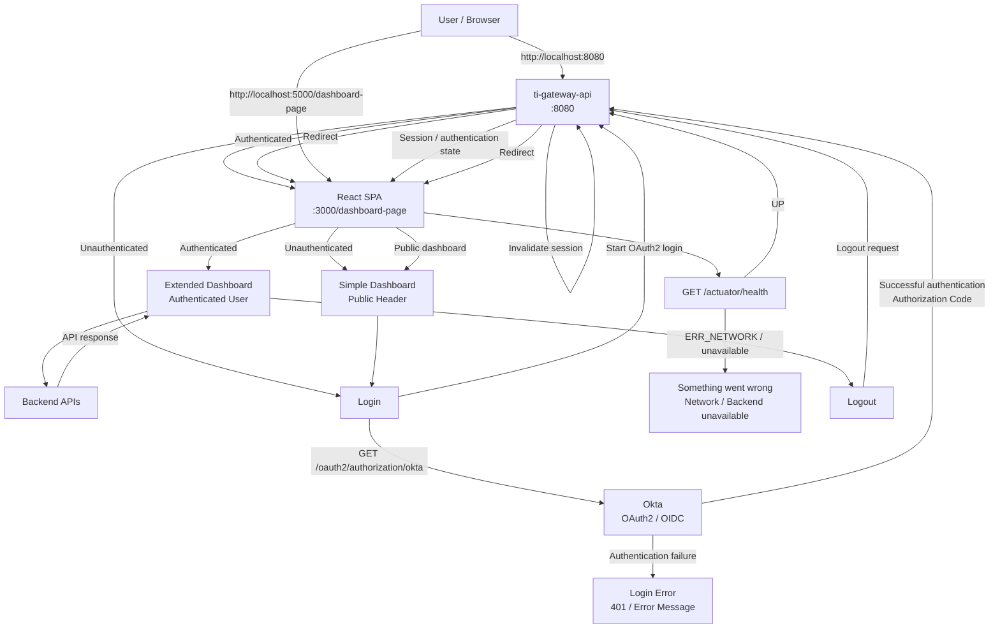

# Authentication and Application Flow

## Overview

The application supports two entry points:

* Direct access through the Gateway: `http://localhost:8080`
* Direct access through the React SPA: `http://localhost:5000/dashboard-page`

The Gateway is responsible for authentication and the user session. The React SPA checks Gateway availability 
and uses the Gateway session to determine whether the user is authenticated.

## End-to-End Flow



## Scenario 1 — Direct Access Through Gateway

The user opens:

```text
http://localhost:8080
```

The Gateway checks the current authentication state.

### Unauthenticated user

The Gateway displays the login page or login entry point.

```text
Browser
   |
   | GET /
   v
Gateway
   |
   | Not authenticated
   v
Login Page
```

The user starts authentication using:

```text
GET /oauth2/authorization/okta
```

The Gateway redirects the browser to the Okta-hosted login page.

```text
Browser
   |
   v
Gateway
   |
   | /oauth2/authorization/okta
   v
Okta
```

After successful authentication, Okta redirects the browser to the Gateway callback:

```text
http://localhost:8080/login/oauth2/code/okta
```

The callback endpoint is handled by Spring Security.

The Gateway:

1. Validates the OAuth2 authorization response.
2. Exchanges the authorization code for tokens.
3. Creates the authenticated SecurityContext.
4. Creates the local HTTP session.
5. Stores the authenticated state in the session.
6. Redirects the browser to:

```text
http://localhost:5000/dashboard-page
```

The React application then displays the authenticated dashboard.

### Login failure

If authentication fails, the Gateway should provide a controlled response.

Possible behavior:

```text
401 Unauthorized
```


The important point is that authentication failures should not result in an unhandled Spring exception or a generic server error page.

---

# Scenario 2 — Direct SPA Access With Backend Down

The user opens:

```text
http://localhost:5000/dashboard-page
```

The SPA initializes and checks:

```text
GET http://localhost:8080/actuator/health
```

If the Gateway is unavailable:

```text
ERR_NETWORK
```

or the health endpoint cannot be reached, the SPA displays:

```text
Something went wrong
Network Issue

Backend service is currently unavailable.
Please try again later.
```

The application should not attempt to render the authenticated dashboard because the authentication state cannot reliably be determined.

---

# Scenario 3 — Direct SPA Access by Unauthenticated User

The user opens:

```text
http://localhost:5000/dashboard-page
```

The SPA performs:

```text
GET http://localhost:8080/actuator/health
```

The Gateway responds:

```json
{
  "status": "UP"
}
```

The SPA then determines the current authentication state.

If the user is not authenticated:

```text
Public Header
       |
       +-- Login

Simple Dashboard
```

The user can browse the public/simple dashboard but cannot access protected functionality.

---

# Scenario 4 — Login From the Simple Dashboard

The user clicks:

```text
Login
```

The button immediately enters a loading state:

```text
[ Loading... ]
```

and becomes disabled to prevent multiple authentication requests.

The browser is redirected to:

```text
http://localhost:8080/oauth2/authorization/okta
```

The Gateway starts the OAuth2 Authorization Code Flow.

```text
React
  |
  | /oauth2/authorization/okta
  v
Gateway
  |
  v
Okta Hosted Login
  |
  | Authentication
  v
Gateway
  |
  | /login/oauth2/code/okta
  |
  | Create local session
  v
React
  |
  v
Extended Dashboard
```

The important distinction is:

```text
/oauth2/authorization/okta
```

is the **login initiation endpoint**.

```text
/login/oauth2/code/okta
```

is the **OAuth2 callback endpoint**.

The React application should normally redirect to the first endpoint and should not directly invoke the callback endpoint.

---

# Scenario 5 — Authenticated Dashboard

After successful authentication, the Gateway maintains the authenticated user through the local session.

The browser communicates with the Gateway using the session cookie.

```text
React SPA
    |
    | HTTP request + session cookie
    v
Gateway
    |
    | authenticated request
    v
Backend APIs
```

The React application does not need to store the OAuth2 access token in:

* `localStorage`
* `sessionStorage`
* React state

This keeps the OAuth2 credentials outside the browser application's JavaScript-accessible storage.

The Gateway can then communicate with protected backend services using the appropriate OAuth2 access token/JWT.

---

# Scenario 6 — Logout

The authenticated user clicks:

```text
Logout
```

The UI sends a logout request to the Gateway.

```text
React
   |
   | Logout
   v
Gateway
   |
   | Invalidate HTTP session
   | Clear authentication
   | Delete session cookie
   v
React
```

The UI then navigates to:

```text
http://localhost:5000/dashboard-page/logout
```

The logout component can display:

```text
You have been logged out.
```

and provide:

```text
Login
```

The important security operation is performed by the Gateway:

```text
invalidate session
        +
clear authentication
        +
delete session cookie
```

The UI route `/dashboard-page/logout` is only a presentation route.

---

# Route and Error Handling

## Gateway Routes

| Route                        | Purpose             | Authentication            |
| ---------------------------- | ------------------- | ------------------------- |
| `/`                          | Gateway entry point | Depends on authentication |
| `/oauth2/authorization/okta` | Start OAuth2 login  | Public                    |
| `/login/oauth2/code/okta`    | OAuth2 callback     | Spring Security           |
| `/logout`                    | Logout              | Authenticated             |
| `/actuator/health`           | Health check        | Public/controlled         |
| `/api/**`                    | Backend APIs        | Authenticated             |
| `/swagger-ui/**`             | API documentation   | Environment-dependent     |
| `/v3/**`                     | OpenAPI             | Environment-dependent     |

## Frontend Routes

| Route                    | Purpose                |
| ------------------------ | ---------------------- |
| `/dashboard-page`        | Main dashboard         |
| `/dashboard-page/logout` | Logout result          |
| `/question`              | Question functionality |
| `/project`               | Project functionality  |
| `/error`                 | Global error page      |
| `/relogin`               | Re-login flow          |

---

# UI State Model

The SPA should distinguish three primary states:

```text
                    Application Start
                           |
                           v
                  Check Backend Health
                     /           \
                  DOWN            UP
                   |               |
                   v               v
              Error View      Check Session
                                  /    \
                                 /      \
                         Unauthenticated Authenticated
                              |              |
                              v              v
                       Simple Dashboard  Extended Dashboard
                              |              |
                              v              v
                           Login           Logout
```

## State 1 — Backend Unavailable

```text
Something went wrong
Network Issue
```

## State 2 — Backend Available + Unauthenticated

```text
Public Header
+
Simple Dashboard
+
Login
```

## State 3 — Backend Available + Authenticated

```text
Authenticated Header
+
Extended Dashboard
+
Projects
+
Questions
+
Import
+
Export
+
Search
+
Future AI Chatbot
```

---

# Static Resource Errors

If the Gateway is expected to serve or proxy UI resources and the requested resource does not exist, it should return a controlled JSON 404 response instead of an HTML error page.

Example:

```json
{
  "status": 404,
  "error": "Not Found",
  "message": "Requested resource was not found",
  "path": "/static/example.js"
}
```

This is particularly useful for API consumers and troubleshooting.

---

# Enterprise Architecture Assessment

The proposed flow is appropriate for an enterprise application, with the following architecture:

```text
                ┌─────────────┐
                │    Okta     │
                │ OAuth2/OIDC │
                └──────┬──────┘
                       │
                 Authorization
                    Code Flow
                       │
                       v
┌──────────────┐  Session  ┌──────────────────┐
│ React SPA    │◄─────────►│ ti-gateway-api   │
│ :3000        │           │ :8080            │
└──────────────┘           │ OAuth2 Client    │
                           │ BFF / Gateway    │
                           └────────┬─────────┘
                                    │
                              JWT / OAuth2
                                    │
                    ┌───────────────┼───────────────┐
                    v               v               v
             Knowledge API   Orchestrator API   Other APIs
```

### The main advantages

| Area                         | Approach                         |
| ---------------------------- | -------------------------------- |
| Authentication               | Okta + OAuth2/OIDC               |
| Login flow                   | Authorization Code Flow          |
| Browser authentication state | HTTP session                     |
| OAuth2 client                | Gateway                          |
| Backend protection           | Resource Servers                 |
| Browser token storage        | Not required                     |
| API access                   | Gateway/BFF                      |
| Backend availability         | `/actuator/health`               |
| UI failure handling          | Global fallback view             |
| Login failure                | Controlled error                 |
| Logout                       | Gateway session invalidation     |
| Public dashboard             | Available without authentication |
| Protected dashboard          | Available after authentication   |

### One recommendation

I would keep the **health check separate from authentication**.

For example:

```text
GET /actuator/health
```

answers:

> "Is the Gateway available?"

while a separate endpoint such as:

```text
GET /api/v1/auth/me
```

could answer:

> "Who is the currently authenticated user?"

This gives the SPA a clean initialization sequence:

```text
1. GET /actuator/health
       |
       +-- failure → Network Error View
       |
       +-- UP
            |
            v
2. GET /api/v1/auth/me
       |
       +-- 401 → Simple Dashboard
       |
       +-- 200 → Extended Dashboard
```

