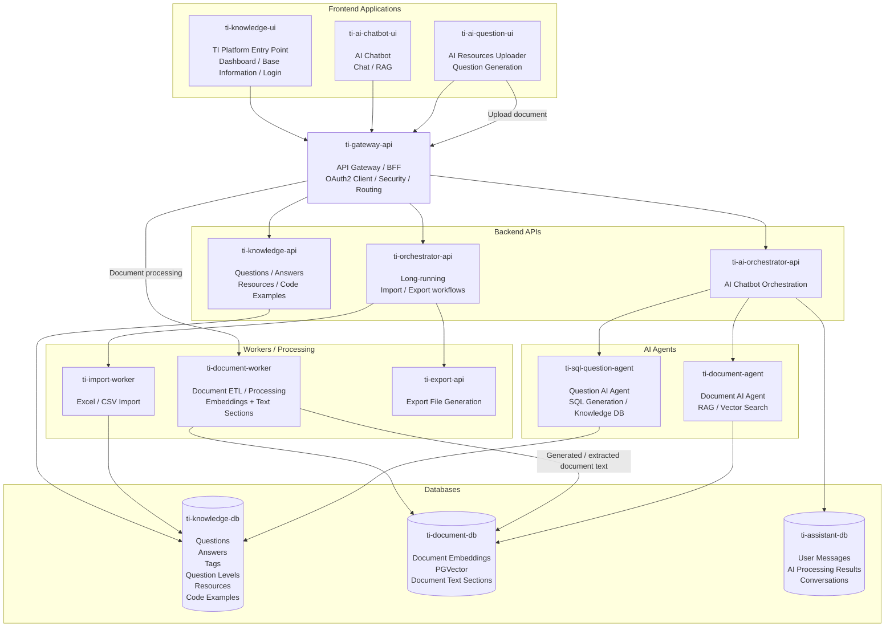
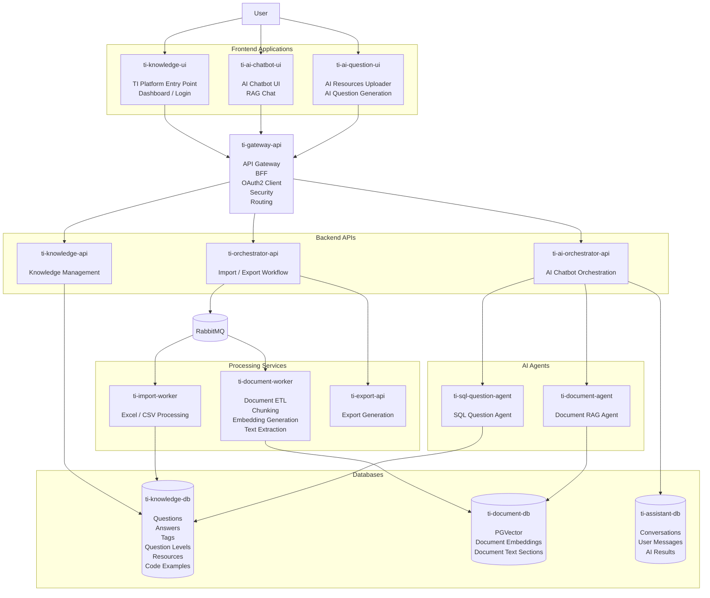
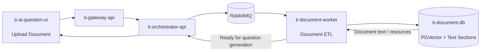
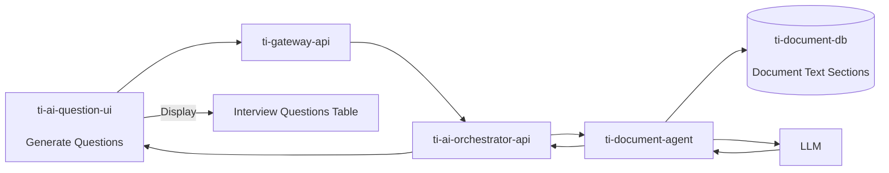
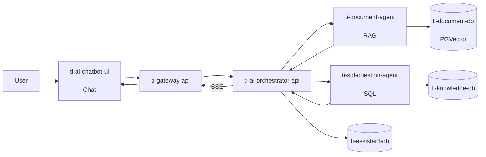
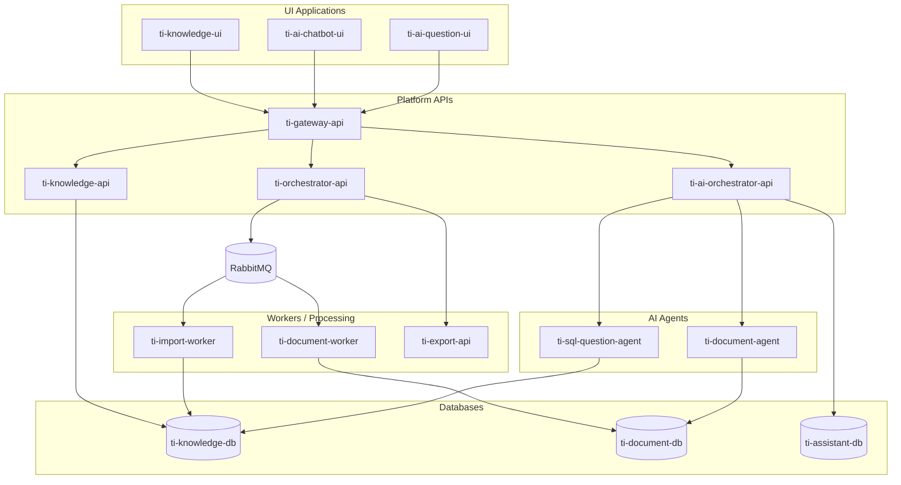
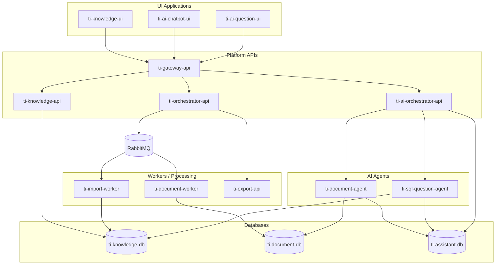
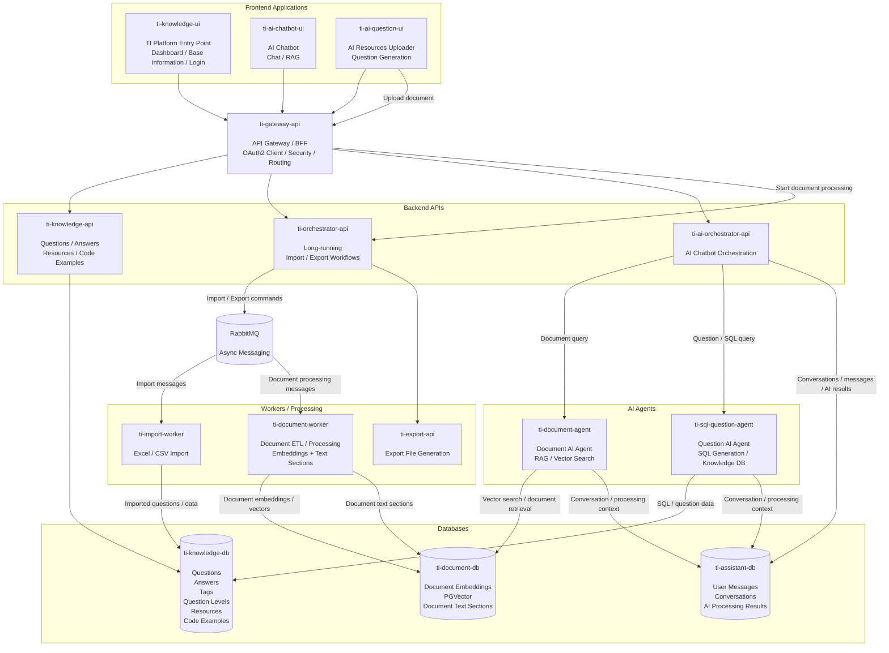

There are also two important distinctions:

* `ti-knowledge-ui` is the **entry point for the whole TI Platform**.
* `ti-ai-chatbot-ui` and `ti-ai-question-ui` are separate frontend applications reached through the platform/gateway.
* `ti-orchestrator-api` is for the **import/export workflows**, while `ti-ai-orchestrator-api` is specifically responsible for the **AI chatbot / AI orchestration**.
* `ti-document-worker` handles document ingestion/ETL and stores both **embeddings in `ti-document-db`** and **document text sections** for question generation.
* `ti-document-agent` and `ti-sql-question-agent` are the AI agents.

## Current architecture 



### One thing I would change in the above diagram

The direct:

```text
ti-ai-question-ui
        ↓
ti-gateway-api
        ↓
ti-document-worker
```

is conceptually correct, but your actual upload flow is more likely:

```text
ti-ai-question-ui
       │
       ▼
ti-gateway-api
       │
       ▼
ti-orchestrator-api
       │
       ▼
RabbitMQ
       │
       ▼
ti-document-worker
```

**if the document processing is implemented as a long-running asynchronous workflow.**

Given your current architecture, I would therefore recommend the following more accurate **logical architecture diagram**.

---

# Recommended architecture diagram



---

# 2. The two most important flows

These two flows should be very clear in architecture documentation.

## A. AI Resources Uploader + Question Generation



Then question generation:



---

# 3. AI Chatbot flow

And the second application has a completely different responsibility:



This makes the distinction between the two applications very clear:

```text
ti-ai-question-ui
        │
        ├── Upload resources
        ├── Generate interview questions
        ├── Review questions
        └── Save questions
```

versus:

```text
ti-ai-chatbot-ui
        │
        ├── Ask questions
        ├── Classical RAG
        ├── SQL questions
        └── Receive AI answers
```

---

# 4. Complete current microservice map

Based on current implementation, the services as:



Absolutely. If both AI Agents need access to the assistant-side data, we should connect **`ti-document-agent`** and **`ti-sql-question-agent`** to **`ti-assistant-db`**.

Updated **#4 Complete current microservice map**:



### The important change

Previously:

```text
ti-document-agent  --> ti-document-db
ti-sql-question-agent --> ti-knowledge-db
```

Now:

```text
ti-document-agent  --> ti-document-db
                   --> ti-assistant-db

ti-sql-question-agent --> ti-knowledge-db
                      --> ti-assistant-db
```

So the responsibilities become:

| Component                | Primary DB        | Assistant DB |
| ------------------------ | ----------------- | ------------ |
| `ti-document-agent`      | `ti-document-db`  | ✅            |
| `ti-sql-question-agent`  | `ti-knowledge-db` | ✅            |
| `ti-ai-orchestrator-api` | —                 | ✅            |
| `ti-knowledge-api`       | `ti-knowledge-db` | —            |
| `ti-document-worker`     | `ti-document-db`  | —            |
| `ti-import-worker`       | `ti-knowledge-db` | —            |

This makes sense if **`ti-assistant-db` contains conversation/message/AI-processing context that the agents themselves need to read or update**, rather than making the orchestrator the only component allowed to access it.

---

Yes. The best approach is to make the **second diagram self-contained**, while preserving the richer descriptions from the first diagram and adding **RabbitMQ** plus the updated **AI Agent → `ti-assistant-db`** connections.

Here is the combined version:



### prefer this version

It combines the **visual/business descriptions** of the first diagram 
with the **actual technical communication paths** of the second one:

```text
                         FRONTENDS
     ┌──────────────────────────────────────────────┐
     │ knowledge-ui   chatbot-ui   question-ui     │
     └──────────────────────┬───────────────────────┘
                            │
                            ▼
                    ti-gateway-api
                            │
             ┌──────────────┼──────────────┐
             ▼              ▼              ▼
       knowledge-api   orchestrator-api   ai-orchestrator
             │              │              │
             ▼              ▼              ▼
      knowledge-db     RabbitMQ          AI Agents
                            │          ┌────┴────┐
                       ┌────┴────┐     ▼         ▼
                       │         │ document   SQL Question
                       ▼         ▼   Agent       Agent
                  import-worker document-worker │
                       │         │               │
                       ▼         ▼               ▼
                  knowledge-db document-db   knowledge-db

                         AI Agents
                            │
                            ▼
                     assistant-db
```

One important correction from the first diagram is also incorporated:

**`ti-ai-question-ui` does not directly call `ti-document-worker`.**

Instead:

```text
ti-ai-question-ui
       │
       ▼
ti-gateway-api
       │
       ▼
ti-orchestrator-api
       │
       ▼
   RabbitMQ
       │
       ▼
ti-document-worker
```

This keeps the UI independent of the worker and preserves the asynchronous workflow.

And for the AI side:

```text
ti-ai-orchestrator-api
        │
        ├──────────────► ti-document-agent ─────► ti-document-db
        │                         │
        │                         └─────────────► ti-assistant-db
        │
        └──────────────► ti-sql-question-agent ─► ti-knowledge-db
                                  │
                                  └─────────────► ti-assistant-db
```

So this single Mermaid diagram can now be used **independently as the complete current architecture diagram**.
