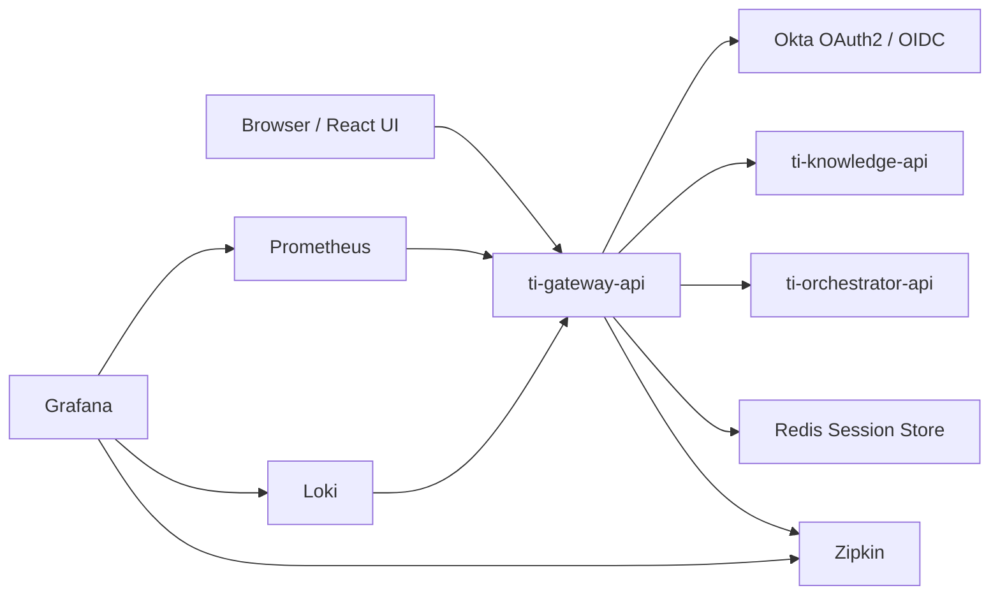

# TI Gateway API

Training Internal Knowledge Platform gateway service built with Java 21 and Spring Boot 4.

The gateway provides:

- OAuth2 / OpenID Connect login with Okta;
- session-based authentication;
- REST API routing;
- Backend-for-Frontend functionality;
- downstream service integration;
- Server-Sent Events proxying;
- file upload forwarding;
- Redis-backed HTTP sessions;
- distributed tracing;
- metrics and structured logging.

---

## Technology Stack

### Backend

- Java 21
- Spring Boot 4.0.7
- Spring MVC
- Spring Security OAuth2 Client
- Spring Session
- Redis
- REST APIs
- Server-Sent Events
- OpenAPI / Swagger
- Micrometer
- OpenTelemetry
- Zipkin
- Prometheus
- Grafana
- Maven

### Infrastructure

- Docker
- Docker Compose
- PostgreSQL
- Redis
- RabbitMQ
- Loki
- Prometheus
- Grafana
- Zipkin

---

## Architecture



---

## Requirements

Install the following tools:

- Java 21
- Maven 3.9 or newer
- Docker
- Docker Compose
- Git

Verify the installed versions:

```shell
java -version
mvn -version
docker version
docker compose version
```

---

## Project Structure

```text
.
├── docker/
│   ├── docker-compose-full.yml
│   ├── docker-compose-infra.yml
│   ├── env.example
│   ├── observability/
│   └── README.md
├── src/
│   ├── main/
│   │   ├── java/com/wk/ti/
│   │   │   ├── config/
│   │   │   ├── controller/
│   │   │   ├── route/
│   │   │   ├── security/
│   │   │   ├── sse/
│   │   │   └── throttling/
│   │   └── resources/
│   │       └── application.yml
│   └── test/
├── Dockerfile
├── pom.xml
└── README.md
```

---

## Build

Build the application:

```shell
./mvnw clean verify
```

On Windows:

```shell
mvnw.cmd clean verify
```

The generated JAR is located under:

```text
target/ti-gateway-api-0.0.1-SNAPSHOT.jar
```

Run the application locally:

```shell
./mvnw spring-boot:run
```

The default application URL is:

```text
http://localhost:8080
```

---

## Configuration

The application reads configuration from environment variables and `src/main/resources/application.yml`.

Common variables:

```text
SERVER_PORT=8080

APPLICATION_URL=http://localhost:8080
LOGOUT_URL=http://localhost:8080/logout

OKTA_DOMAIN=your-okta-domain.okta.com
OKTA_OAUTH2_CLIENT_ID=your-client-id
OKTA_OAUTH2_CLIENT_SECRET=your-client-secret

SESSION_SSL_ENABLED=false
SESSION_CACHE_HOST=localhost
SESSION_CACHE_PORT=6379

KNOWLEDGE_SERVICE=localhost
KNOWLEDGE_SERVICE_PORT=8081
KNOWLEDGE_BASE_URL=http://localhost:5000

MANAGEMENT_TRACING_EXPORT_ZIPKIN_ENDPOINT=http://localhost:9411/api/v2/spans

SSE_EMITTER_TIMEOUT=30m
SSE_HEARTBEAT_INTERVAL=15s
SSE_MAX_CONNECTIONS=1000
```

Do not commit secrets to Git.

Create a local environment file from the example:

```shell
cd docker
cp env.example env
```

Update the values in `docker/env`.

---

## Run Redis Only

From the repository root:

```shell
docker compose -f docker/_02_redis-service.yaml up -d
```

Then start the gateway from IntelliJ IDEA or with Maven:

```shell
./mvnw spring-boot:run
```

Stop Redis:

```shell
docker compose -f docker/_02_redis-service.yaml down
```

---

## Run Infrastructure for Local Development

This mode runs infrastructure in Docker while Spring Boot applications run on the host machine.

Infrastructure includes:

- Redis;
- RabbitMQ;
- PostgreSQL;
- Prometheus;
- Loki;
- Grafana;
- Zipkin;
- Grafana Alloy.

Start the infrastructure:

```shell
cd docker
docker compose -f docker-compose-infra.yml --env-file env up -d
```

Check running containers:

```shell
docker compose -f docker-compose-infra.yml ps
```

Stop the infrastructure:

```shell
docker compose -f docker-compose-infra.yml --env-file env down
```

Run the gateway locally:

```shell
cd ..
./mvnw spring-boot:run
```

When running locally, use the following Zipkin endpoint:

```text
http://localhost:9411/api/v2/spans
```

---

## Run the Full Docker Environment

The full environment runs the infrastructure and application containers together.

Before starting, build the application image:

```shell
./mvnw clean package -DskipTests
docker build -t gateway-local:latest .
```

The Dockerfile expects the following file:

```text
target/ti-gateway-api-0.0.1-SNAPSHOT.jar
```

Start the full environment:

```shell
cd docker
docker compose -f docker-compose-full.yml --env-file env up -d
```

Check service status:

```shell
docker compose -f docker-compose-full.yml ps
```

View gateway logs:

```shell
docker logs -f gateway-service
```

Stop the full environment:

```shell
docker compose -f docker-compose-full.yml --env-file env down
```

Remove containers and volumes:

```shell
docker compose -f docker-compose-full.yml --env-file env down -v
```

---

## REST Endpoints

The gateway base path is:

```text
/api/v1
```

The gateway forwards supported requests to downstream services.

Typical endpoints include:

```text
GET    /version
GET    /api/v1/**
POST   /api/v1/**
PUT    /api/v1/**
DELETE /api/v1/**
POST   /api/v1/**/upload
```

The exact downstream route is determined by the gateway routing configuration.

---

## Server-Sent Events

The gateway exposes an SSE subscription endpoint:

```text
GET /api/v1/ai-assistant/sse/subscription/{conversationId}/{questionId}
```

The endpoint returns:

```http
Content-Type: text/event-stream
Cache-Control: no-cache
X-Accel-Buffering: no
```

The endpoint proxies the downstream SSE stream to the browser.

### SSE subscription example

Using `curl`:

```shell
curl --no-buffer \
  -H "Accept: text/event-stream" \
  -H "Cookie: SESSION_COOKIE_VALUE" \
  "http://localhost:8080/api/v1/ai-assistant/sse/subscription/conversation-123/42"
```

The `--no-buffer` option is important when testing streaming responses with `curl`.

### Browser example

```javascript
const conversationId = "conversation-123";
const questionId = 42;

const source = new EventSource(
  `/api/v1/ai-assistant/sse/subscription/${conversationId}/${questionId}`
);

source.addEventListener("connected", event => {
  console.log("SSE connected:", event.data);
});

source.addEventListener("ping", event => {
  console.debug("SSE heartbeat:", event.data);
});

source.addEventListener("data", event => {
  console.log("SSE data:", event.data);
});

source.addEventListener("server-error", event => {
  console.error("SSE server error:", event.data);
});

source.onerror = error => {
  console.error("SSE connection error:", error);
};
```

### Important SSE requirements

For reliable SSE delivery:

- do not buffer the response;
- do not compress `text/event-stream`;
- configure a long proxy read timeout;
- send heartbeat events periodically;
- close the downstream connection when the client disconnects;
- limit the number of concurrent subscriptions;
- preserve SSE event fields such as `event`, `data`, `id`, and `retry`.

Example Nginx configuration:

```nginx
location /api/v1/ai-assistant/sse/ {
    proxy_http_version 1.1;
    proxy_buffering off;
    proxy_cache off;
    proxy_read_timeout 1h;
    proxy_send_timeout 1h;
}
```

---

## Health and Actuator Endpoints

The following actuator endpoints are exposed:

```text
GET /actuator/health
GET /actuator/info
GET /actuator/metrics
GET /actuator/prometheus
```

Check application health:

```shell
curl http://localhost:8080/actuator/health
```

Check Prometheus metrics:

```shell
curl http://localhost:8080/actuator/prometheus
```

---

## API Documentation

Springdoc endpoints:

```text
http://localhost:8080/v3/api-docs
http://localhost:8080/swagger-ui/index.html
```

---

## Observability

### Prometheus

```text
http://localhost:9090
```

Prometheus scrapes:

```text
http://localhost:8080/actuator/prometheus
```

### Grafana

```text
http://localhost:3000
```

Default local credentials:

```text
Username: admin
Password: admin
```

Change the password using:

```text
GRAFANA_ADMIN_PASS=your-secure-password
```

When Grafana runs inside Docker, use Docker service names for datasource URLs:

```text
Prometheus: http://prometheus:9090
Loki:       http://loki:3100
Zipkin:     http://zipkin:9411
```

When Grafana runs directly on the host, use:

```text
Prometheus: http://localhost:9090
Loki:       http://localhost:3100
Zipkin:     http://localhost:9411
```

### Zipkin

```text
http://localhost:9411
```

### Loki

```text
http://localhost:3100
```

---

## Security

The gateway uses:

- OAuth2 Authorization Code flow;
- OpenID Connect;
- Okta;
- Redis-backed Spring Session;
- secure downstream request forwarding.

The browser authenticates with the gateway using a session cookie. The gateway uses the authenticated identity when calling downstream services.

Do not expose client secrets or session secrets in source control.

---

## Testing

Run all tests:

```shell
./mvnw test
```

Run verification and generate the JaCoCo report:

```shell
./mvnw clean verify
```

The JaCoCo report is generated under:

```text
target/site/jacoco/index.html
```

Recommended SSE test cases:

- successful stream connection;
- downstream `401` response;
- downstream `404` response;
- downstream `500` response;
- downstream connection failure;
- browser/client disconnect;
- emitter timeout;
- heartbeat delivery;
- multi-line SSE data;
- event IDs;
- retry fields;
- executor saturation;
- response buffering;
- response compression.

---

## Docker Troubleshooting

### The gateway cannot connect to Redis

For local execution:

```text
SESSION_CACHE_HOST=localhost
SESSION_CACHE_PORT=6379
```

For Docker Compose execution:

```text
SESSION_CACHE_HOST=redis-session
SESSION_CACHE_PORT=6379
```

### The gateway cannot connect to Zipkin

For local execution:

```text
MANAGEMENT_TRACING_EXPORT_ZIPKIN_ENDPOINT=http://localhost:9411/api/v2/spans
```

For Docker Compose execution:

```text
MANAGEMENT_TRACING_EXPORT_ZIPKIN_ENDPOINT=http://zipkin:9411/api/v2/spans
```

### SSE events arrive in batches

Check the following:

1. `curl` is using `--no-buffer`;
2. Nginx or the ingress controller has `proxy_buffering off`;
3. the response is not compressed;
4. the downstream service flushes each event;
5. the proxy read timeout is long enough;
6. the gateway does not buffer the complete response;
7. the browser is connecting to the SSE endpoint directly rather than using a JSON REST client.

### SSE connections close unexpectedly

Check:

1. emitter timeout;
2. downstream read timeout;
3. reverse proxy read timeout;
4. load balancer idle timeout;
5. heartbeat interval;
6. executor saturation;
7. client reconnection behavior;
8. gateway and downstream logs.

---

## Docker Cleanup

Remove stopped containers:

```shell
docker container prune
```

Remove unused images:

```shell
docker image prune
```

Remove unused volumes:

```shell
docker volume prune
```

Use volume cleanup carefully because it can delete PostgreSQL, Redis, RabbitMQ, Loki, and Grafana data.

---

## Development Guidelines

- Use Java 21 language features where they improve readability.
- Keep controllers thin.
- Keep downstream routing in service classes.
- Do not use the generic REST forwarding path for long-lived SSE responses.
- Keep SSE response handling separate from normal JSON forwarding.
- Do not buffer an SSE response into `String` or `byte[]`.
- Add tests for every new route.
- Do not log secrets, tokens, cookies, or client credentials.
- Use structured logging for production diagnostics.
- Use explicit timeouts for all downstream HTTP clients.
- Protect the application against unlimited concurrent SSE